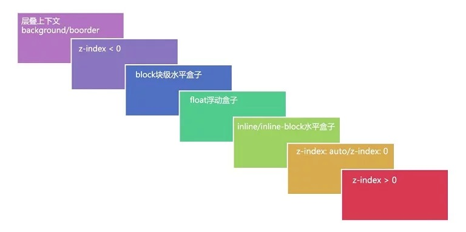

# CSS上下文的层叠顺序

## 一. 层叠上下文
层叠上下文(The stacking context)在HTML中是一个三维的概念，这些HTML元素在一条假想的相对于面向（电脑屏幕的）视窗或者网页的用户的z轴上延伸，HTML元素依据其自身属性按照优先级顺序占用层叠上下文的空间。

#### 条件
文档中层叠上下文由满足其下任意条件的元素形成
- 根元素(HTML)
- `z-index` 值不为 "auto"的 绝对/相对定位
- 一个 `z-index` 值不为 "auto"的 flex 项目 (flex item)，即：父元素 display: flex|inline-flex，
- `opacity` 属性值小于 1 的元素
- `transform` 属性值不为 "none"的元素
- `mix-blend-mode` 属性值不为 "normal"的元素，
- `filter`值不为“none”的元素
- `perspective`值不为“none”的元素
- `isolation` 属性被设置为 "isolate"的元素
- `position: fixed`
- 在 `will-change` 中指定了任意 CSS 属性
- `-webkit-overflow-scrolling` 属性被设置 "touch"的元素

在层叠上下文中，子元素同样按照上面规则进行层叠。子元素的`z-index`只在父级层叠上下文中有意义。子元素的层叠上下文自动被视为父元素的层叠上下文的一个独立单元。如果一个元素拥有层叠上下文，其比普通元素离屏幕观察者更近。

#### 特性
- 层叠上下文的层叠水平要比普通元素高
- 层叠上下文可以阻断元素的混合模式
- 层叠上下文可以嵌套，内部层叠上下文及其所有子元素均受制于外部的层叠上下文。
- 每个层叠上下文和兄弟元素独立，也就是当进行层叠变化或渲染的时候，只需要考虑后代元素。
- 每个层叠上下文是自成体系的，当元素发生层叠的时候，整个元素被认为是在父层叠上下文的层叠顺序中。

## 二. 层叠水平
层叠水平(stacking level)决定同一个层叠上下文元素在z轴的显示顺序。普通元素的层叠水平优先由层叠上下文决定。只有层叠上下文中比较层叠水平才有意义。

## 三. 层叠顺序
上文中的层叠上下文与层叠水平是概念，而层叠顺序是规则。在CSS2.1中，层叠顺序遵循下图


补充的信息
- 位于最低的border / background指层叠上下文的边框与背景。每一个层叠上下文只适用于一个完整的层叠上下文元素。
- `inline-block`与inline水平元素是同等级别
- `z-index: 0`与`z-index: auto`单纯从层叠元素上看是一致的，实际上在层叠上下文中有根本性的差异

#### 层叠准则
当元素发生覆盖的时候，其覆盖关系遵循以下准则。
1. 具有明显层叠标识(如识别的z-index)，在同一个层叠上下文领域，层叠水平值大的覆盖小的。
2. 当元素的层叠水平一致、层叠顺序相同的时候，在DOM流中处于后面的元素会覆盖前面的元素。

## 四. 层叠上下文与层叠顺序
一旦普通元素拥有了层叠上下文，其层叠顺序就会变高。其层叠顺序由该元素`z-index`值决定
- 如果层叠上下文不依赖于`z-index`值，则其层叠顺序为`z-index: auto`，可看成`z-index: 0`级别
- 如果层叠上下文依赖于`z-index`，则层叠顺序由`z-index`决定

## 五. 例子
#### 1. z-index
##### html: 
```xml
<div class="container1">
    <div class="box"></div>
</div>
<div class="container2">
    <div class="box"></div>
</div>
```

##### z-index: auto 
```css
    .container1,
    .container2 {
        position: relative;
        z-index: auto;
    }
    .box {
        position: absolute;
        width: 200px;
        height: 200px;
    }
    .container1 > .box {
        height: 300px;
        background: blue;
        z-index: 2;
    }
    .container2 > .box {
        width: 300px;
        background: red;
        z-index: 1;
    }
```

此时两个container的`z-index`值均为auto，其为普通元素。而其内的box拥有明显不一致`z-index`值。所以box的z-index决定了box1覆盖在box2的上方。

##### z-index: 0 
```css
    .container1,
    .container2 {
        position: relative;
        z-index: 0;
    }
```

当两个container的`z-index`值均为0时，其形成了层叠上下文。在相同的层叠顺序情况下。遵循规则为DOM元素靠后的覆盖靠前的。所以box2覆盖在了box1的上方

#### 2. flex
##### html
```xml
<div class="container">
    <div class="content">
        <div class="son"></div>
    </div>
</div>
```

##### display:block
```css
.content {
    background: blue;
    z-index: 1;
}

.content > .son {
    width: 200px;
    height: 200px;
    z-index: -1;
    background: red;
}
```

此时son元素被content元素的蓝色背景覆盖，因为从顺序图上, `z-index`为负的元素小于块级元素。

##### display: flex
```css
.container {
    display: flex;
}
```
如果将最外层元素的display设为flex，则z-index不为auto的flex的子元素形成了层叠上下文。则比较顺序变为`z-index`为负的元素大于层叠上下文，故son元素覆盖content的蓝色背景。

> 本例讲述了CSS3中新属性带来形成层叠上下文中的变化，相似例子均可以本例推演。

## 6. 参考

[深入理解CSS中的层叠上下文和层叠顺序](https://www.zhangxinxu.com/wordpress/2016/01/understand-css-stacking-context-order-z-index/) - 张鑫旭