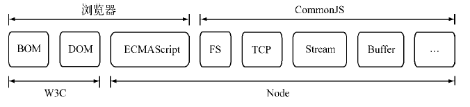
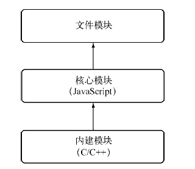
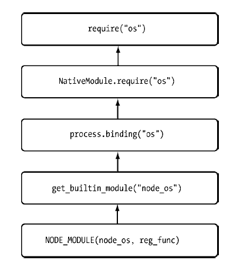
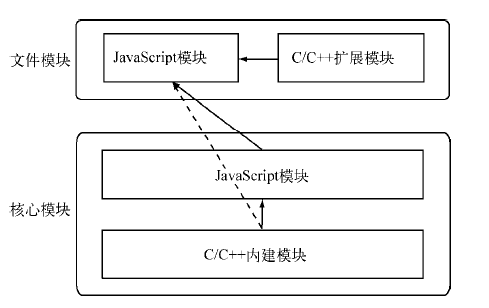
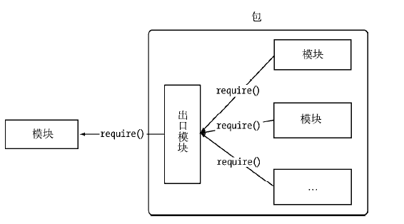

# 模块机制

## CommonJS规范
在实际应用中，Javascript的表现能力取决于宿主环境的API支持程度。而对于js自身其缺陷在于
- 没有模块系统
- 标准库较少
- 没有标准接口
- 缺乏包管理系统

CommonJS的提出主要是弥补其没有标准的缺陷，以达到能开发大型应用的基础能力。Node与浏览器以及W3C，CommonJS，ECMAScript的关系如下图



#### 规范

##### 1. 模块引用 
e.g.
```javascript
var math = require('math');
```

`require`方法接受模块标识，引入一个模块的API到当前上下文中。

##### 2. 模块定义
在Node中，一个文件就是一个模块。而将方法挂载在`exports`对象上作为属性即可定义导出的方式

- `require`: 引入外部模块
- `exports`: 导出当前模块的方法或者变量
- `module`: `module`对象代表模块自身，`exports`是`module`的属性

```js
// hello.js
exports.hello = function() {
    // ...
}

// index.js
var hello = require('hello');
exports.say = function() { retrun hello.hello(); }
```

##### 3. 模块标识
模块标识指的是传递给`require`方法的参数，需要为**符合小驼峰命名**的字符串，或者是相对/绝对路径。可以没有文件后缀`.js`。模块使得类聚的方法和变量限定在私有的作用于中，同时支持引入和导出功能来链接上下游依赖。

## Node模块实现
Node中引入模块，包括：

1. 路径分析
2. 文件定位
3. 编译执行

而模块主要分为两类，Node提供的模块，称为**核心模块**，另一类用户编写的模块**文件模块**

- 核心模块在Node源代码的编译过程中，编译为二进制执行文件，在Node进程启动时直接加载进内存。所以在核心模块引入时，文件定位和编译执行这两个步骤可以省略掉，并在路径分析中优先判断，其加载速度最快。
- 文件模块在运行时动态加载，需要完整的路径分析，文件定位，编译执行等过程。

#### 模块加载过程

与前端浏览器缓存静态文件一样，Node对引入过的模块都会进行缓存来减少二次引入的开销。其缓存的是**编译和执行之后的对象**。对于两种模块而言都是，二次加载都是一律以缓存优先的方式。而核心模块的缓存检查优先于文件模块。

##### 模块标识符分析

模块标识符的加载顺序依次为
1. 核心模块
2. 路径形式的文件模块
    以`.`、`..`和`/`开始的标识符，`require`分析路径时会将路径转化为真实路径并以其为索引将编译结果放入缓存
3. 自定义模块
    指的是非路径模块，也不是路径形式的标志符。这类文件可能是一个文件或者包的形式。自定义模块查找根据模块路径(定位文件系统的具体文件时的查找策略)，具体表现为**一个路径组成的数组**。其生成规则为
    - 当前文件目录下的node_modules
    - 父目录下的node_modules
    - 父目录的父目录下的node_modules
    - 路径向上递归，直到根目录下的node_modules

##### 文件定位

在分析标识符的过程中，会出现不包含扩展名的情况。CommonJS规范也允许不包含文件扩展名，此种情况下，Node按照`.js`, `.json`, `.node`次序补充扩展名依次尝试。

> 尝试时会调用fs模块同步阻塞式的判断文件是否存在，Node的单线程导致可能引起性能问题。所以如果是`.node`或者`.json`文件传递给`require`时带上扩展名，会加快一点速度。

在分析标识符的过程中，通过分析之后可能得到的是一个目录，Node会将目录当成一个包来进行处理。在这个过程中Node会对当前目录下查找package.json，通过`JSON.parse()`解析出包描述对象，从中取出`main`属性指定的文件名进行定位，文件缺少扩展名时进行如上的分析步骤。如果`main`属性指定文件名错误，Node会将index当成默认文件名。

##### 模块编译
在`Node`中，每一个文件模块都是一个对象，编译与执行是引入文件模块的最后一个阶段。模块定义如下:

```js
function Module(id, parent) {
    this.id = id;
    this.exports = {};
    this.parent = parent;

    if (parent && parent.children) {
        parent.children.push(this);
    }

    this.filename = null;
    this.loaded = false;
    this.children = [];
}
```

定位到具体文件之后，Node会新建一个模块对象然后根据路径载入并编译。而每一次编译成功的模块都会将其文件路径作为索引缓存放在`Module._cache`对象上来提高二次引入的性能。

- 对于`.js`文件，通过`fs`模块同步读取文件后编译执行
- 对于`.node`文件，这是用C/C++编写的扩展文件，通过`dlopen()`方法加载最后编译来生成文件
- 对于`.json`文件，通过`fs`模块同步读取文件后，用`JSON.parse`解析返回结果
- 其余扩展名文件，都将被当成`js`文件载入

> 如果想对自定义扩展名进行特殊加载，可以通过类似`require.extensions['.ext']`的方式实现。但是官方推荐是先将其他语言或文件编译成js文件之后再进行加载。

1. js模块编译

    在js模块中，`require`、`exports`、`module`、`__filename`以及`__dirname`这些变量并未在模块文件中定义。而是Node对获取的js文件内容进行了包装，在头部添加了`function(exports, require, module, __filename, __dirname){}`。这样来使每个模块文件之间都进行了作用域隔离。包装之后的代码通过vm原生模块的`runInThisContext()`方法执行，返回一个具体的`function`对象。最后将模块对象的`exports`等作为参数传递给这个`function()`执行。

2. C/C++模块编译

    Node通过`dlopen`的是方法进行加载和执行，在Windows和*nix平台下不同的实现是通过libuv兼容层进行了封装。这里只有加载和执行的过程。

3. JSON文件的编译

    Node利用`fs`模块同步读取JSON文件的内容之后，调用`JSON.parse`得到对象，然后赋给模块对象的`exports`来供外界调用。


## 核心模块

#### js模块编译过程

在编译所有C/C++文件之前，编译程序需要将所有的JavaScript文件编译为C/C++代码，Node会使用V8附带的`js2c.py`工具来将内置的Javascript代码转换为C++里的数组，此过程中js代码以字符串的形式存储在Node命令空间中，不可执行。启动Node进程时会直接加载进内存，这时核心模块经历标识符分析后直接定位到内存中。

此时lib目录下的模块文件还没有经历头尾包装的过程，在启动之后头尾包装，才执行和导出`exports`对象。所以与文件模块的区别在于**核心模块时从内存加载的**，以及缓存执行结果的位置。核心模块中源文件会通过`process.binding('natives')`取出，编译成功的模块缓存到`NativeModule._cache`对象上，文件模块则缓存到`Module._cache`对象上。

##### e.g.
```js
function NativeModule(id) {
    this.filename = id + '.js';
    this.id = id;
    this.exports = {};
    this.loaded = false;
}

NativeModule._source = process.binding('natives');
NativeModule._cache = {}
```

#### C/C++核心模块编译过程
在核心模块中，可能存在两种包含C/C++编写的情况。包括全部由C/C++的方式以及C/C++实现核心，通过js实现封装的方式。Js主外实现封装的模式是Node能够提升性能的常见方式。


##### 内建模块

全部由C/C++编写。在定义后通过`NODE_MODULE`宏将模块定义到node的命名空间中。可以通过`get_builtin_module()`方法从`node_module_list`数组中取出这些模块。

内建模块的优势在于本身由C/C++编写，性能优于脚本语言。进行文件编译时被编译成二进制文件，Node开始执行时直接加载进内存中，直接可以执行。

Node中的模块的层级关系如下:


Js的核心模块可能会依赖于内建模块。内建模块时如何将内部变量或者方法导出来供外部JS模块调用的？

1. Node在启动时生成一个全局变量`process`，并提供`Binding()`方法来协助加载内建模块
2. 创建一个`exports`空对象，然后调用`get_builtin_module`方法取出内建模块对象。
3. 执行`register_func()`来填充`exports`对象
4. 将`exports`对象按模块名缓存并返回给调用方法方完成导出

之前提到js核心文件被转化为C/C++数组存储后，就是通过`process.binding('native')`取出放置在`NativeModule._source`中的。这个方法会将`js2c.py`转换出的字符串数组取出，对js核心模块进行编译和执行。

##### e.g.

os原生模块的引入流程:


## 模块调用栈

各模块的调用关系如下
- C/C++内建模块属于最底层的模块，属于核心模块，提供API给JS核心模块和第三方JS文件模块调用，尽量避免通过`process.binding()`方法直接调用
- JS核心模块主要有两类职责，一种是C/C++内建模块的封装层和桥接层，一种是纯粹的功能模块。
- 文件模块通常由第三方编写，包括普通JavaScript模块和C/C++扩展模块，主要调用为普通JS模块调用扩展模块



## 包与npm

Node组织了自身的核心模块，在第三方模块中，模块与模块依然散列而不能相互引用，在模块之外，包和NPM是将模块联系起来的一种机制。包的出现，是在模块的基础上进一步组织JavaScript代码。包由包结构和包描述文件两个部分组成，前者用于组织包中的各种文件，后者用于描述包的相关信息。包组织模式如下



#### 包结构
包实际上是存档文件，由一个目录打包成`.zip`或者`tar.gz`格式的文件，安装后解压还原为目录。

- package.json: 包描述文件
- bin: 可执行二进制文件目录
- lib: 存放js代码目录
- doc: 存放文档目录
- test: 单元测试用例的代码

#### npm常用功能

通过`node help <command>`可以查看详细信息。

##### 安装依赖包

安装依赖包的执行语句是`npm install express`，执行命令之后npm会在当前目录下创建`node_modules`目录，然后在`node_modules`目录下创建`express`目录，之后将包解压到目录下。

- 全局模式安装: 如果包中含有命令行工具，需要执行`npm install express -g`进行全局模式安装，全局模式实际上是将包安装为全局可用的可执行命令，这将根据包描述的`bin`字段配置将实际脚本链接到与Node可执行文件相同的路径下。全局模式安装的模块包可以通过推算出来: `path.resolve(process.execPath, '..', '..', 'lib', 'node_modules');`
- 从本地安装：没有发布到npm或者网络原因无法直接安装的包，可以将包下载然后在本地安装，只要为NPM指明`package.json`的位置即可。
    ```bash
    $ npm install <tarball file>
    $ npm install <tarball url>
    $ npm install <folder>
    ```

## 前后端共用模块

鉴于网络的原因，前端模块采用同步的方式引入的话将会在用户体验上造成很大的问题，所以CommonJS为后端JavaScript指定的规范并不完全适合前端的应用场景。所以前端产生了两种规范

- [AMD(Asynchronous Module Definition)](https://github.com/amdjs/amdjs-api/wiki/AMD) 
- CMD()

#### AMD规范

AMD是CommonJS模块规范的一个延伸，其模块id和依赖是可选的，与Node模块相似的地方在于`factory`的内容就是实际代码的内容。而不同之处在于，AMD模块需要用`define`来明确定义一个模块，在Node实现中是隐式包装的。其目的都是作用域隔离，只在需要的时候被引入，而另一个区别是内容需要通过返回的方式实现导出。其模块定义如下
```js
define(id?, dependencies?, factory);

// e.g.
define(function() {
    var exports = {};
    exports.sayHello = function() {
        alert('Hello ' + module.id);
    }   
    return exports;
});
```

#### CMD规范
CMD规范与AMD的主要区别在于定义模块和依赖引入的部分。AMD需要在声明模块的时候指定所有的依赖，通过形参传递到依赖模块内容中，而CMD在依赖支持动态引入，`require`、`exports`、`module`通过形参传给模块，需要依赖时随时调用`require`

##### e.g.
```javascript
// AMD
define(['dep1', 'dep2'], function(dep1, dep2) {
    return function() {};
});

// CMD
define(function(require, exports, module) {
    require('dep1');
    require('dep2');
});
```

#### 兼容模块例子

```js
;(function(name, definition) {
    // 检测AMD或CMD
    var hasDefine = typeof define === 'function',
    // 上下文是否为Node
        hasExports = typeof module !== 'undefined' && module.exports;

    if (hasDefine) {
        // AMD || CMD
        define(definition);
    } else if (hasExports) {
        // 普通Node模块
        module.exports = definition();
    } else {
        // 挂载在window变量中，this指向window对象
        this[name] = definition()
    }
})('hello', function() {
    var hello = function () {};
    return hello;
})
```
