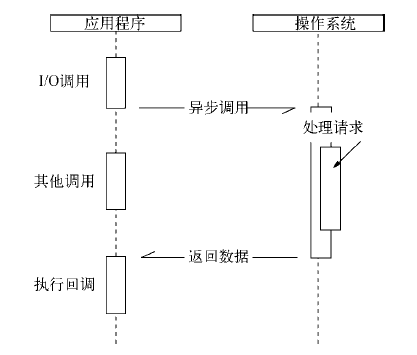
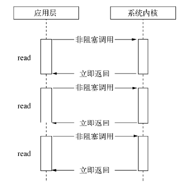
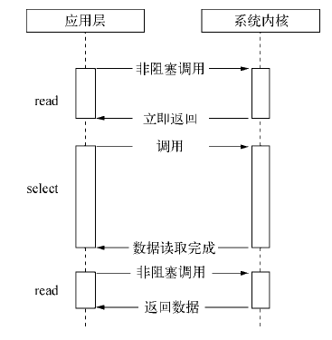
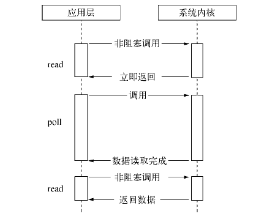
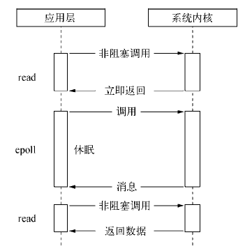

# 异步I/O

如果业务中有互不相关的任务需要完成，主流方法包括
- 单线程串行一次执行
- 多线程并行

如果创建多线程的开销小于并行执行，多线程的方式是首选的。其代价在于**创建线程和执行期线程上下文切换的开销较大**。并且，在复杂业务中可能面临锁、状态同步等问题。但是多线程能够在多核CPU上有效提升CPU的利用率。

单线程顺序执行的方式比较符合开发人员的思维方式。但是缺点在于性能，任意一个略慢的任务将导致后续执行代码被阻塞。计算机资源中通常I/O与CPU计算之间是可以并行进行的，同步中I/O的进行会让后续任务等待。

而Node的方案为：

- 利用单线程，远离多线程死锁、状态同步等问题
- 利用异步I/O，让单线程远离阻塞，更好的利用CPU

异步I/O的调用示意图：

## 异步I/O实现现状

#### 异步与非阻塞I/O

从计算机内核I/O而言，对于I/O只有阻塞与非阻塞两种方式。

- 阻塞I/O： 调用之后一定要等到系统内核层面完成所有操作后，调用才结束。
- 非阻塞I/O： 调用之后立即返回

> 内核在进行文件I/O的时候，通过文件描述符进行管理。应用程序如果需要进行I/O调用，需要先打开文件描述符，然后再根据文件描述符去实现文件的数据读写。此处非阻塞I/O与阻塞I/O的区别在于阻塞I/O完成整个获取数据的过程，而**非阻塞I/O则不带数据直接返回，要获取数据，还需要通过文件描述符再次读取**。

非阻塞I/O的问题在于，由于完整的I/O并没有完成，立即返回的并不是业务层期望的数据，而仅仅是当前调用的状态。为了获取完整的数据，应用程序需要重复调用I/O操作来确认
是否完成。这种重复调用判断操作是否完成的技术叫做轮询。

#### 轮询

- read: 它是最原始、性能最低的一种，通过重复调用来检查I/O的状态来完成完整数据的读取。在得到最终数据前，CPU一直耗用在等待上。

- select: 它是在read的基础上改进的一种方案，通过对文件描述符上的事件状态来进行判断。其采用一个1024长度的数组来存储状态，最多可以检查1024个文件描述符

- poll: 采用链表的方式避免数组长度的限制，且能避免不需要的检查。

- epoll: 该方案是Linux下效率最高的I/O事件通知机制，在进入轮询的时候如果没有检查到I/O事件，将会进行休眠，直到事件发生将它唤醒。它是真实利用了事件通知、执行回调的方式，而不是遍历查询，所以不会浪费CPU，执行效率较高。

尽管epoll可以使用事件来降低CPU的耗用，但是休眠期间CPU几乎是闲置的。我们期望的完美的异步I/O应该是应用程序发起非阻塞调用，无须通过遍历或者事件唤醒等方式轮询，可以直接处理下一个任务，只需在I/O完成后通过信号或回调将数据传递给应用程序即可。在Linux在存在一种异步I/O方式(AIO)，通过信号或回调来传递数据的。但是AIO只存在于Linux中，而且其缺陷在于，仅支持内核I/O中的O_DIRECT方式读取，无法利用系统缓存。