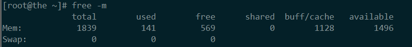

# Linux入门(1)

## 基础

#### Linux发行版本

Linux发行版是在Linux内核之上的软件集合。发行版可以将服务器软件，系统管理工具，文档和许多桌面应用程序捆绑在中央安全软件存储库中。其发行版旨在提供通用外观，安全便捷的软件管理。

- Red Hat Enterprise Linux(RHEL)
- Ubuntu
- Debian
- CentOS
- others

#### 许可证

存在两种主要的软件范例分别为[自由开源软件(FOSS)](https://www.gnu.org/philosophy/free-sw.html)与专有软件。但即使类型不一样，他们也使用同样的版权法，从法律角度上，用户通常可以通过自由开源软件获得的权利比专利许可证权利更多，但是基础许可机制是相同的。[常见的许可证](https://www.oschina.net/question/54100_9455)包括

- GNU General Public License
- BSD license
- MIT license


#### 查看Linux状态

##### lsb_release -a

`lsb_release`命令用来查看当前系统的发行版信息。但是对于某些未安装此命令的发行版，可以通过查看`etc/issue`文件用来得到发行版信息。

##### free 

`free`工具用来查看系统的可用内存。可以通过其参数分别使用(T/G/M/K/B)来调整显示的基本单位。`free`命令显示系统内存的使用情况，包括物理内存、交换内存与内核缓冲区。其命令信息来自于`/proc/meminfo`文件

`free`命令的结果如图



- Mem行: 内存的使用情况
- Swap行: 交换空间使用情况
- total列: 系统总可用物理内存和交换空间大小
- used列: 已经被使用的物理内存和交换空间
- free列： 可使用的物理内存和交换空间
- shared列： 被共享使用的物理内存大小
- buff/cache: 被buff/cache使用的物理内存的大小
- available列：还可以被应用程序使用的物理内存大小

> `buffer`在操作系统中指`buffer cache`即缓冲区，我们存在两个概念：“扇区”和“块”，块是文件系统的最小的寻址单元，一个块会包含多个扇区，大小不能超过一个页面。一个块被调入内存时，其存储在一个缓冲区中并与其对应，相当于是磁盘块在内存中的表示。`cache`在操作系统中指`page cache`即页高速缓存。是内核实现的磁盘缓存，页高速缓存的是内存页面。缓存中的页来自对普通文件、块设备文件和内存映射文件的读写。页高速缓存对块设备文件的缓存就是`buffer cache`。所以缓冲区其实是概念上比较特殊的页高速缓存。而在linux内核2.4中，才将这两种方式的实现统一。所以此列才叫做`buff/cache`

`free`列中是真正尚未被使用的物理内存数量，而`available`是从应用程序的角度看到的可用内存数量。`buffer`和`cache`都属于已经被使用的内存，当应用程序需要内存时，内核就会从`buffer`和`cache`中回收内存来满足需求，所以应用程序通常看内存的角度应该是`available = free + buffer + cache`。但是实际上而言这个数据通常有较大误差。

## man

通常`man`存在多种用法来查看相关信息

- `man $command`: 查询相关命令，e.g `$ man whois`
- `man $configfile`： 查询相关配置文件, e.g `$ man syslog.conf`
- `man $daemon`：查询大多数守护进程，e.g `% man syslogd`
- `man -k`: 查询有关字符串的列表目录

#### sections

执行`man man`命令会解释在`man`目录中存在多个章节目录。

```bash
1 Executable programs or shell commands
2 System calls (functions provided by the kernel)
3 Library calls (functions within program libraries)
4 Special files (usually found in /dev)
5 File formats and conventions eg /etc/passwd
6 Games
7 Miscellaneous (including macro packages and conventions), e.g. man(7)
8 System administration commands (usually only for root)
9 Kernel routines [Non standard]
```

当存在多个不同章节相同词条的情况。可以通过`man $section $file`来查询需要的词条。

#### tldr
Linux系统的man帮助文件一般很长，使用github上一个项目，[安装tldr](https://github.com/tldr-pages/tldr)以提供简化的man文件

## directories & files

#### 文件目录操作

##### pwd
定位用户当前位置

##### ls
列出当前目录，常见的例子为
```bash
# -l: long listing, -h: human readable format, -a: all
$ ls -lah
```

##### mkdir / rmdir
`mkdir`用来创建自己的目录。如果存在父级等目录不存在的情况下，应该使用`-p`参数递归创建。相对应的，使用`rmdir`来删除目录，使用`-p`参数来递归的删除目录。

#### 文件目录跳转

##### cd
- `~`: 相当于回到用户主目录，相当于使用`cd`不跟参数
- `..`: 回到上一级目录
- `-`: 回到前一个访问的目录
- `absolute path`
- `relative path`

##### pushd / popd
对于`cd $pwd`与`cd -`而言都是只支持最近操作的两个目录，所以在多个目录之间操作时，可以使用`pushd`与`popd`来进行扩展。通过`pushd`将常见的目录压入栈中，可以迅速进行切换。

- `$ pushd`: 切换到作为参数的目录，并把源目录压入一个虚拟堆栈，不指定参数则回到前一个目录，并把最近的两个目录做交换
- `$ popd`: 弹出堆栈中最近的目录
- `$ dirs -v`: 列出当前堆栈中保存的目录列表

e.g. 在两个工作目录中切换
```bash
# 需要在两个目录中进行频繁切换 如 ~/orange 与 ~/teemper
# 当前目录为 ~
# 首先 将~/orange压入栈中
$ pushd ~/orange
~/orange ~/orange
# 然后将~/teemper压入栈中并进入teemper目录
$ pushd ~/teemper
~teemper ~/orange ~/orange
# pushd进行目录的切换并交换栈顺序，进入~/orange目录
$ pushd
```

##### others
可以通过设置`bashrc`的`alias`来快速跳转。
```bash
# 上一级并列出目录
alias ..='cd .. && ll'
# 跳转nginx conf目录
alias conf='cd /etc/nginx/conf.d'
```

#### 文件

对于所有的Linux文件，都是大小写敏感的。可以将Linux系统中的所有表示都看为文件。常用的Linux文件相关的命令包括：

- `file`: Linux中是不存在文件类型的扩展的。命令行不关心其以`txt`结尾或是以`pdf`结尾。只有通过`$ file`才能得到具体的文件类型。
- `touch`: 创建文件
- `mv`
- `rm`: 可以通过`-i`选项来设置是否确定删除的提示。一般来说`$ rm -r`不能删除非空文件夹，但是`$ rm -rf`可以强制删除文件夹内容
- `cp`
- `rename`

e.g 
```bash
# 拷贝orange文件夹内所有文件到teemper文件夹
$ cp -r ~/orange/* ~/teemper
# 批量重命名(Debian)
$ touch 1.conf 2.conf ; rename 's/conf/backup/' *.conf
```

#### 文件操作

常用的输出文件内容的操作包括

- `head`/`tail`: 输出文件前n行/后n行
- `cat`：其作用是拷贝标准输入到标准输出中
- `tac`: `cat`倒着来的骚操作
- `string`：显示二进制文件的可读`ascii`字符串

## file tree
在许多的Linux发行版中都遵循文件系统的层次结构标准(Filesystem Hirearchy Standard)。在不同的发行版中，文件系统存在一些差异。可以通过`$ man hier`来查找相关文件系统层次结构信息。

#### 根目录 / 
所有的目录结构都以根目录开始。以`/`进行表示。可以从根目录下找到Linux系统中的一切文件。

#### binary directories
二进制文件是包含已编译源代码的文件。可以在计算机上执行，也可被称为可执行文件。

##### /bin

`/bin`目录中包含了所有用户可以使用的可执行文件。一般来说在所有FHS的文件系统中`/bin`目录应该包含`/bin/cat`与`/bin/date`两个命令。在`/bin`中可以找到的常见Unix/Linux命令包括`cat`,`cp`, `date`, `echo`, `grep`等。

> 可以在许多其他目录中找到`/bin`的子目录，例如用户orange可以将自己的程序放在`/home/orange/bin`目录下。而某些应用程序会将自身放在`/opt`中

##### /sbin
`/sbin`中包含的命令通常用于设置操作系统。其大多数要求`root`权限。

##### /lib
从`/bin`与`/sbin`中的二进制文件通常使用的公共库就存放在`/lib`。一般来说Linux内核加载模块时就是从`/lib/modules/$kernel-version/`来进行加载。

##### /opt
`/opt`目录通常用于存放外部的可选软件。举例来说，如果一个名为wp的安装包，其安装后目录会位于`/opt/wp`，二进制文件会存放在`/opt/wp/bin`，man文件会存放在`/opt/wp/man`

#### data directories

##### /home
存放用户私人目录，一般而言对某个用户存放的目录是`/home/$USERNAME`

##### /root
存放root用户目录

#### in memory directories

##### /dev
`/dev`中的设备文件看上去像是普通文件，但其实际上并不位于硬盘上，`/dev`目录用于内核来识别硬件。所以类似于硬盘设备之类的常见硬件由`/dev`中的设备文件表示。其可以分为三类。

- 通用硬盘设备
- `/dev/tty`与`/dev/pts`： `tty`表示的是一个终端或者控制台连接到了系统而形成的文件，而`pts`表示图形界面的一部分终端形成的文件。
- `/dev/null`： 其有无限的存储空间，但是无法从中检索任何内容。所以可以认为写入`/dev/null`中的任何内容都会被丢弃。可用于从命令中丢弃不需要的输出。

##### /proc
`/proc`是另一个特殊的目录，作为二进制文件出现，但是并不占据硬盘空间。其实质上是内核一个视图。在`/proc`中的大度搜狐文件都是0字节，但是包含数据并可以输出。

```bash
$ file /proc/cpuinfo
/proc/cpuinfo: empty
# 输出cpu信息
$ cat /proc/cpuinfo
```

#### /var
对于大小不可预测的文件(e.g. 日志，缓存和假脱机文件)应位于`/var`中

- `/var/log`: 日志数据
- `/var/cache`: 包含缓存数据
- `/var/lib`: 应用程序状态信息