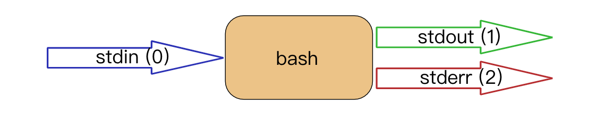

# Linux入门(2)

## 命令行扩展

在Linux上，许多命令都可以在执行之前由shell进行更改。在大多数Linux中使用的命令行或界面被称为`bash`(Bourne Again Shell)，`bash shell`里包含`sh`(原始Bourne Shell)，`csh`(C Shell)，和`ksh`(Korn Shell)的功能。

#### Arguments

Shell脚本的主要作用之一是提供命令行的扫描，其会将命令行的字符串逐一切断为参数。扫描时Shell可能对参数做相应处理。这个过程被称为`shell expansion`。

 - 由一个或者连续多个空格分割的部分被视为单独的参数
 - 第一个参数为执行命令，其他参数赋予命令
 - 可以通过使用引号`'`或者`"`来防止删除空格(但是两种之前存在差别)，引用字符串被视为是一个参数
 - 使用`echo -e`可以输出包含特殊转义字符的字符串

 ##### e.g
 ```bash
 $ echo  Hello    World
 Hello World
 $ echo 'Hello  World'
 Hello  World
 $ echo -e `Line with \ta tab`
 Line with    tab
 ```

 #### 内置commands
 
 > 存在一些在Shell内部内置的commands，外部命令指的是具有二进制文件并存在系统某个位置的命令，通常在`/bin`或者`/sbin`目录下，而内置命令Shell本身带有的部分。

##### type
`type`命令用来标识该命令为外部命令还是内置命令，同样的，也可以用此命令来判断是否是被`alias`设置了别名的情况。

有些命令存在内置命令与外部命令两种版本，此种情况下内置命令优先，要使用外部命令的话需要使用其完整的文件路径。

##### which
`which`命令将在PATH环境变量中搜索命令的二进制文件

##### aliases
Shell中提供创建别名的功能。别名通常用于为现有命令创建更容易记住的名称或轻松提供参数。

e.g
```bash
# 赋值cat命令给dog别名
$ alias dog = cat
$ dog a.txt

# 缩写ls
$ alias ll='ls -lah --color=auto'

# 提供默认的选线
$ alias rm='rm -i'
$ alias vim='vi'

# 查看ll的别名
$ alias ll

# 解除别名
$ unalias ll
```

#### Control Operators
可以使用控制操作符在命令行上使用多个命令。

##### ; semicolon
可以将两个或多个命令放在由分号分割的同一行上。分号前的所有参数都将被视为分号后所有参数的单独命令。两个系列都将按顺序执行，shell将等待每个命令完成，然后再启动下一个命令。

##### & ampersand
在一行以＆符号结尾时，shell将不会等待命令完成。收到提示符后，此命令将在后台执行，执行完成后shell将提示一条信息。

##### $? dollar question mark
上一个命令的退出代码会存储在shell变量`$？`中。

##### && double ampersand
使用`&&`时，仅当第一个命令成功时才执行第二个命令(return 0)。

##### || double vertical bar
只在第一个命令失败时才执行第二个命令，可以通过连接`||`与`&&`的方式来实现`if-then-else`

##### e.g.
```bash
# ampersand
$ start nginx &
# combined && and ||
$ rm file01 && echo success || echo fail
```

#### Shell Variables

`$`符会查找环境变量，将`$`符后面的字符串替换为变量的值(变量不存在时替换为空)。

- 变量为大小写敏感 (`$USER`/`$user`)
- 创建变量 `$ var=12`
- 双引号引用的字符串中，会将`$`变量执行并替换，而单引号会阻止这种行为
- `set`变量会显示环境变量列表，`unset`变量移除变量

##### $PATH

`$PATH`变量会决定bash从哪个路径下来执行查找要执行的命令。shell不会在当前目录中查找要执行的命令，如果需要shell查看当前目录的情况，可以添加目录在`$PATH`的末尾。

##### e.g.

```bash
# 将工作提示符变为prompt
$ PS1=prompt

# delineate variables
$ prefix=Super
$ echo Hello ${prefix}girl and ${prefix}man
```
#### 嵌入式Shell与选项
shell可以嵌入在命令行中，换句话说，命令行扫描可以生成包含当前shell的fork的新进程。可以通过变量来实验。单个嵌入对于避免更改当前目录非常有用。

##### 美式括号嵌入
```bash
$ echo $sth

$ echo $(sth=1; echo $sth)
1

$ echo $sth

```

##### 反引号嵌入
```bash
$ echo `cd /etc; ls -d * | grep pass`
```

#### Shell History

##### !!
重复上一个命令

##### !str
可以通过单个`!`跟一个或者多个字符来进行重复命令，shell将重复以这些字符开头的最后一个命令。

##### history
`history`指令可以显示shell的命令历史记录，可以通过空格来阻止命令记录在历史记录中
```bash
# 此条命令不会被记录
$  ll ~
```

##### ctrl + r
从历史记录中搜索

##### $HISTSIZE / $HISTFILE / $HISTFILESIZE
- $HISTSIZE: 确定将在当前环境中记住的命令数
- $HISTFILE: 指向包含历史记录的文件，这个值默认为`~/.bash_history`
- $HISTFILESIZE: 设置历史文件中保留的命令数

#### File Glob

- `* asterisk`: 与任何字符匹配
- `? question mark`: 与单个字符匹配
- `[] square brackets`: 与中括号中的任一字符匹配

##### e.g

```bash
$ ls *
$ ls f?le[ab][55]
$ ls file[0-9][A-Z][a-z]
```

#### I/O redirection
Unix命令行的一个强大功能是使用输入/输出重定向和管道。

#### stdin / stdout / stderr
命令行包括三种流，分别是输入、输出以及错误流。在Linux中表现为`stdin`(stream 0), `stdout`(stream 1)以及`stderr`(stream 2)。其关系如下图所示


#### Output Redirection
通常，`stdin`是从键盘传入，而其他两种流显示在屏幕上。没有明显的区别。所以可以将此两种流区分开重定向显示。
##### > && >>
通常可以将`stdout`使用`>`来重定向到文件中。`>`实际上是`1>`的缩写，表示将`stdout`重定向到某处。而使用`>`的情况，其**输出文件会被覆盖**。假如命令失败了，文件也会被清除。

> 可以通过`$ set -o noclobber`来设置Linux，使得不能覆盖存在数据的文件。而使用`>|`来进行操作可以覆盖掉`noclobber`强制操作。

e.g.
```bash
$ echo Hello World > hello.txt
```

> 在执行参数0之前，bash通常会有效的从命令行中删除重定向。所以如下的例子中只包含两个参数(echo与hello)

```bash
$ echo hello > hello.txt
```

而对比`>`来说，`>>`操作符可以将流添加到相应文件的尾部。

##### error redirection
通过`2>`来重定向错误流，可以有效的防止刷屏时错误被刷掉而错失信息。例如我们将正常输出输出到文件而将错误输出输出到`/dev/null`中
```bash
$ find / > out.txt 2> /dev/null
```

##### 2>&1
通过这个操作符可以将`stderr`重定向到`stdout`中。这个语法的意思是将`stderr`的流合并到`stdout`中。在多种流同时出现时，按照其顺序判断。而通过`&>`可以将`stderr`与`stdout`合并为一个流到一个文件
```bash
# 将正常流与错误流输入到一个文件中
$ find / > allfiles_and_error.txt 2>&1
# 下面虽然使用了2>&1 但是只是将stdout重定向到了hello.txt。标准错误流在标准流之前已经制作了副本
$ ls 2>&1 > hello.txt
# 合并正常流与错误流
$ echo file42 &> out_and_err 
```

##### stream and pipes
默认情况下，在命令行上使用管道时，不能在`stderr`内部进行`grep`，因为只传递了`stdout`。但是可以通过`2>&1`来进行操作
```bash
# 三个文件都不存在，报错中会展示三个名字，但是grep是没有效果的
$ rm file42 file33 file1201 | grep file42
# 2>&1合并为一个流
$ rm file42 file33 file1201 2>&1 | grep file42
# 无法直接交换stdout与stderr(会输出FILE42，因为还是stdout的流)
$ echo file42 2>&1 1>&2 | sed 's/file42/FILE42/' 
# 通过第三个流来交换stdout与stderr
$ rm file42 3>&1 1>&2 2>&3 | sed 's/file42/FILE42/'
```

#### Input Redirection

##### < && << && <<<

相对的，通过`<`符号与`<<`符号可以完成相反的重定向输出流的工作。`<`可以将`stdin`流输出到屏幕，而`<<`的作用是在于附加输出，直到碰到某个中止信号(通常是EOF)，也可以使用Ctrl-D调用。`<<<`被称为`here string`，其作用是将字符串直接传给某个程序。他的作用在于调用的进程少了一个。

```bash
# 输出hello.txt内容到屏幕
$ cat < hello.txt
# 持续输出text.txt文件直到遇见EOF
$ cat <<EOF > text.txt
# 对字符串调用helloworld
$ base64 <<< helloworld
```
